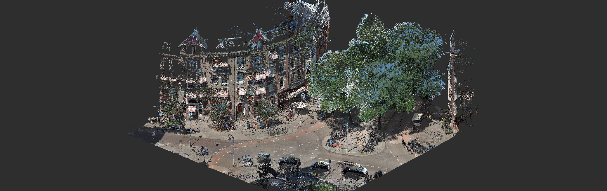
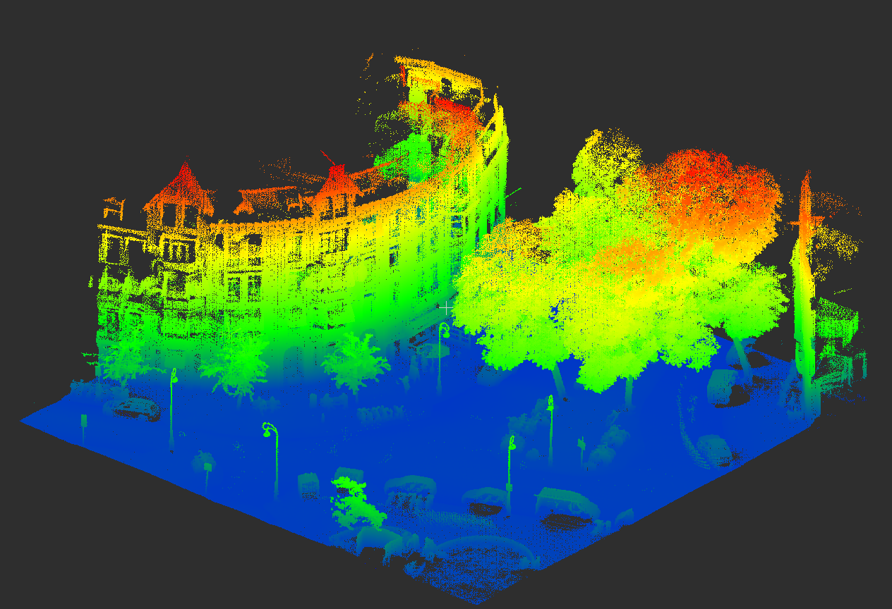
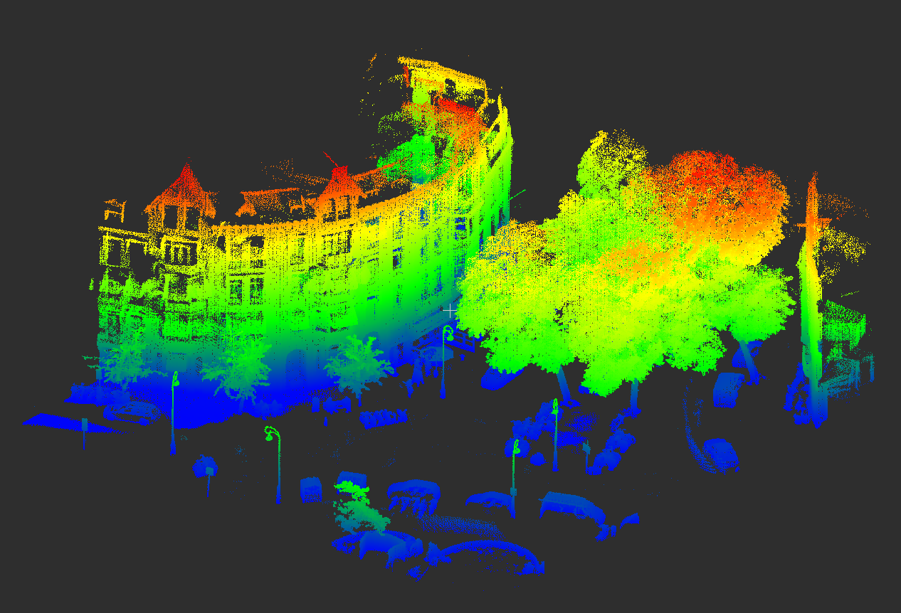

# Fast Ground Segmentation of 3D Point Clouds
Ground plane fitting algorithm for fast ground removal in LAS/LAZ Point Clouds. A preprocessing step, where ground points removal significantly reduces the number of points involved in proceeding computations.



## Pseudocode
This project is based on the pseudocode of the ground plane fitting algorithm proposed in the work of [Zermas et al.](https://ieeexplore.ieee.org/abstract/document/7989591) The pseudocode is described below.

```python
P: point cloud
num_iter_: number of iterations
num_lpr_: number of points used to estimate the LPR
th_seeds_: threshold points to be considered initial seeds
th_dist_: threshold distance of the plane

mainLoop(P):
    P_ground = extractInitialSeeds(P)
    for i in 1 : num_iter_:
        model = estimatePlane(P_ground);
        clear(P_ground, P_notground)
        for point p in PointCloud P:
            if model(p) < th_dist_:
                add p to P_ground；
            else
                add p to P_notground;
    return P_ground, P_notground

extractInitialSeeds(P):
    P_sorted = sortOnHeight(P)
    LPR_height = Average(P_sorted(1 : num_lpr_));
    clear(P_seeds)
    for i in 1 : P_sorted.size:
        if P_sorted[i].z < LPR_height + th_seeds_:
            add p_sorted[i] to P_seeds
    return P_seeds
```

## Prerequisites
- Install [LAStools](http://lastools.org/):

   ```
   wget  http://lastools.github.io/download/LAStools.zip
   unzip LAStools.zip
   cd LAStools; mkdir build; cd build
   cmake ..
   sudo make install
   ```

- Install [PCL](https://github.com/PointCloudLibrary/pcl):

   ```
   sudo apt install libpcl-dev
   ```

## Installation instructions
- Download the project.

   ```
   git clone https://github.com/Amsterdam-AI-Team/3D_Ground_Segmentation.git
   ```

- Build the project as follows.

   ```
   mkdir build  
   cd build
   cmake ..
   make
   ```

- Run the project.

   ```
   cd build
   ./ground_plane_fit
   ```

## Example
|  | | |
|:---:|:---:|:---:|
